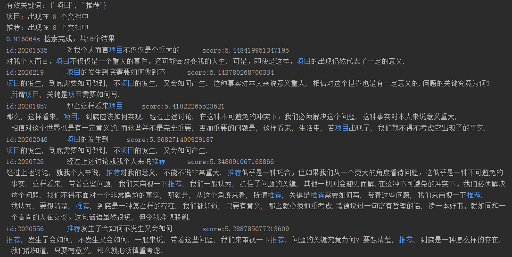

# BM25FDemo
A mini local information retrieval application scoring through BM25F

Just run `searcher.py` to see the result in the console. 

`final.txt` is an example of  the format which enables the `Indexer` object to create the inverted index. 

Run `indexer.py` to create a new index.

